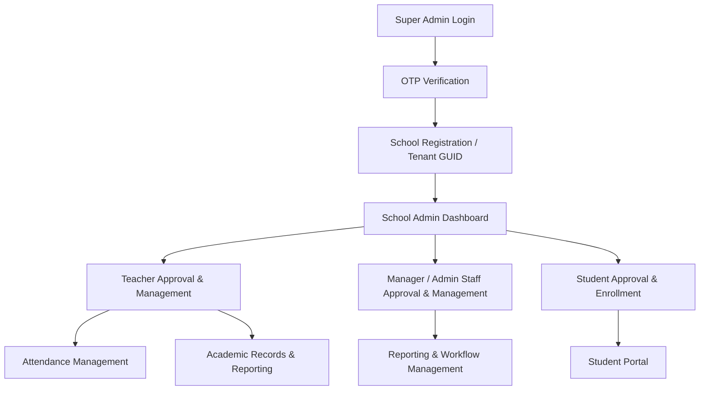
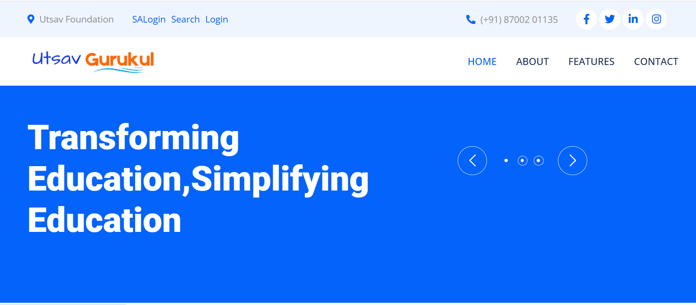
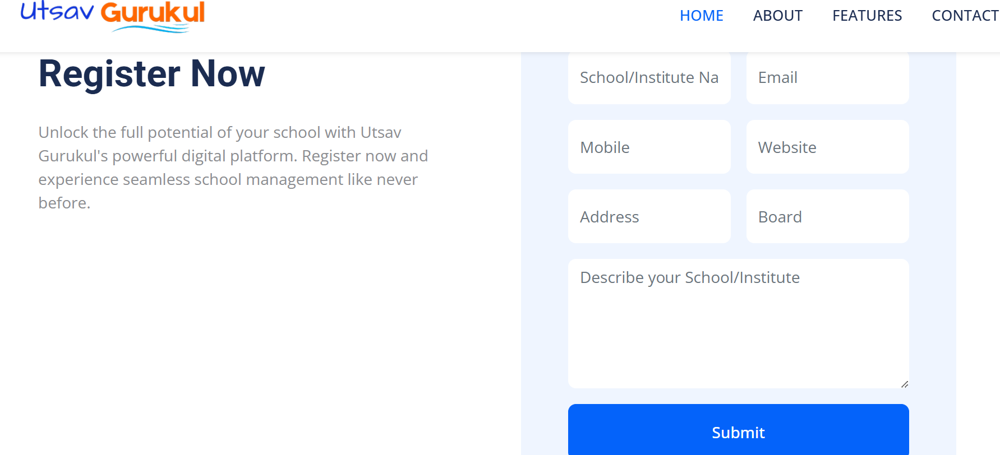
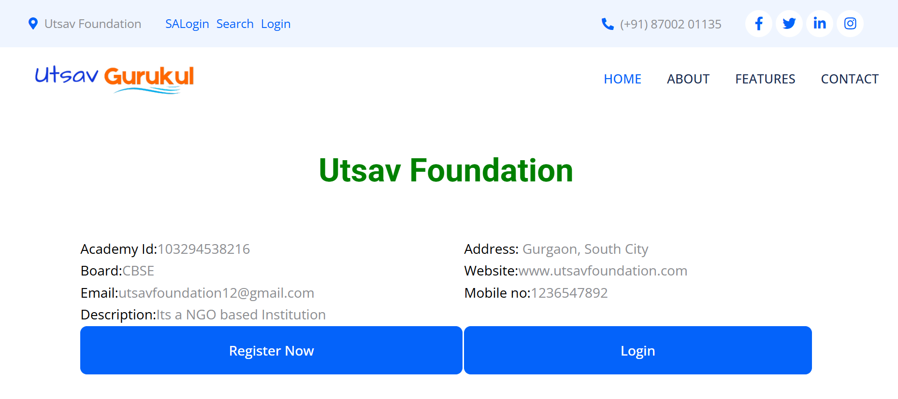
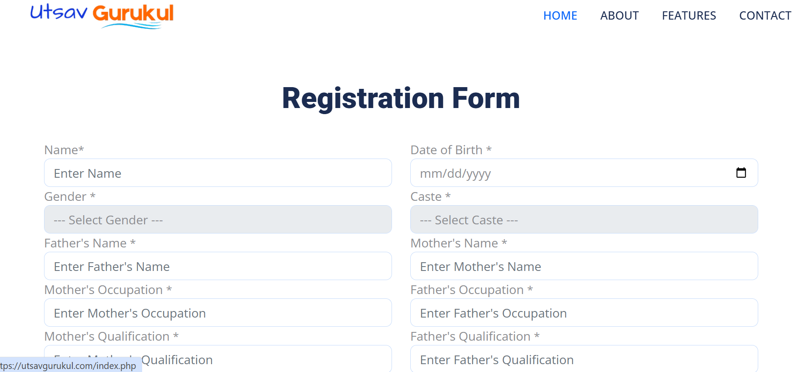

# 🏫 Utsav Gurukul — Multi-Tenant School Management Platform

> A centralized, multi-tenant SaaS-style school management platform enabling multiple educational institutions to securely manage students, staff, and academic records with role-based access, dynamic modules, and tenant-based data isolation.  

> **Note:** Source code is proprietary. This repository serves as a case study highlighting architecture, security, and backend engineering contributions.

---

## 🔗 Live Platform
The project is **live on Hostinger**: [Utsav Gurukul](https://utsavgurukul.com/)

---

## 🚀 Project Overview
- **Objective:** Develop a secure, scalable multi-tenant platform allowing multiple schools to manage their data independently.  
- **Role:** Backend Engineer – multi-tenancy design, RBAC implementation, session management, schema isolation, data integrity, and security.  
- **Outcome:** Production-ready system supporting multiple schools with isolated datasets, dynamic module generation, and automated workflows for students, teachers, managers, and administrative staff.

---

## 🛠 Tech Stack
- **Frontend:** HTML5, CSS3, Vanilla JavaScript  
- **Backend:** PHP 7/8 (RESTful routing, session-based authentication)  
- **Database:** MySQL (Normalized multi-tenant schema with referential integrity and tenant-based partitioning)  
- **Security:** OTP-based authentication, multi-role login, role-based access control, session management, input sanitization, hashed passwords  
- **Hosting:** Hostinger (Production deployment)

---

## ✨ Core Features & Workflow
1. **Custom Multi-Role Login**  
   - Special **Control Panel login system** where users enter:  
     - **Academy ID** (unique tenant ID for each school)  
     - **Login as:** Student, Teacher, Admin, or Super Admin  
     - **User ID & Password**  
   - Only valid credentials for the selected role allow access.  
   - Powered by **Utsav Foundation login module** ensuring secure authentication.  

2. **Super Admin Authentication & OTP Verification**  
   - Super Admin manages tenant (school) registrations.  
   - OTP verification ensures secure onboarding.  

3. **School Registration & Unique Tenant ID**  
   - Each school receives a **GUID** as a unique identifier.  
   - Tenant ID enforces **data isolation** and acts as a logical partition key.

4. **Dynamic Module Generation**  
   - Schools dynamically create classes, teacher profiles, student records, and staff modules without redeploying the system.  
   - All CRUD operations are scoped to the tenant ID.

5. **Role-Based Access Control (RBAC)**  
   - **School Admin:** Approves teachers, managers, and student enrollments.  
   - **Teachers:** Manage attendance, academic records, and class workflows.  
   - **Managers / Admin Staff:** Handle administrative tasks, reporting, and validation workflows.  
   - **Students:** View grades, attendance, and academic resources.  
   - Access privileges enforced using **PHP sessions** and permission matrices.  

6. **Data Isolation & Integrity**  
   - All queries are filtered by tenant ID to prevent cross-school data access.  
   - Normalized database design ensures **referential integrity** and secure multi-tenant operations.

7. **Attendance, Academic Records & Reporting**  
   - Teachers manage attendance schemas and academic workflows.  
   - Managers and admin staff handle reporting, validations, and workflow management.  
   - Dashboards provide analytics and audit logs per school.

---

## 📊 System Architecture Diagram

🖼 Screenshots

### Control Panel Login (Student / Teacher / Admin / Super Admin)
 

### School Enrollement
 

### Registered School Details
 

### Student Registration
 

📄 My Contributions

-Developed multi-role login system with Academy ID, role selection, and secure credential verification.

-Architected multi-tenant backend with GUID-based data isolation.

-Developed dynamic schema modules for students, teachers, managers, and administrative staff.

-Implemented RBAC with PHP sessions and permission matrices for multiple roles.

-Built OTP-based authentication and secure session workflows.

-Designed normalized MySQL schema with referential integrity and tenant-based query partitioning.

-Developed dashboards, reporting features, and validation workflows for operational efficiency.

-Deployed and maintained live production instance on Hostinger with secure multi-tenant architecture.

📢 Notes

This repository is for documentation purposes only.
Source code is proprietary, but this case study demonstrates backend engineering expertise in multi-tenancy, RBAC, dynamic modules, multi-role login, and production-grade secure web application architecture.
